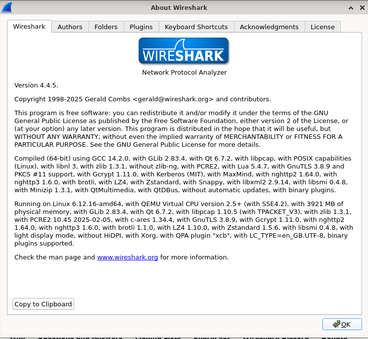

# ANYsec and MKA over UDP Packet Dissectors for Wireshark

This repository provides a Lua-based Wireshark dissector for Nokia's ANYsec encryption protocol. ANYsec leverages MKA (MACsec Key Agreement) over UDP for key distribution and security association management, enabling encryption across networks where standard MACsec would not be feasible.

ANYsec extends MACsec beyond Layer 2, allowing encryption across IP and MPLS transport networks. MKA (MACsec Key Agreement) typically runs over Ethernet, but in ANYsec, it is encapsulated in UDP/IP to support key exchange over routed networks.

In Wireshark, dissectors decode packet structures, displaying key fields and metadata in a human-readable format to facilitate network analysis. As both ANYsec and MKA over UDP extend the funcitionality of MACsec and MKA, respectively, while keeping the original PDU format, it is possible to create dissectors for both by calling the Wireshark's original dissectors.

### Usage

Tshark Commands

## Prerequisites/Requirements

The dissectors were tested on Wireshark version 4.4.5 with lua support for Linux and Windows 10 and 11.

The 64-bit Windows version has lua support built-in from what I've tested. The official [installer](https://www.wireshark.org/download.html) for the x64 was the one tested.

On linux, there are different Wireshark builds for each different distribution, which means the dissectors might not work. In some Wireshark builds there is no lua support and some distributions maintain older Wireshark versions, that don't make the MACsec dissector available to be called through the lua API. We explain how to check for [lua support]() and if the MACsec dissector is [callable through the lua API]().

If you own a Mac or a ARM windows and test the dissector, give some feedback please

### Check for Lua support

In order to check if your Wireshark build has lua support press "Help" > "About Wireshark" and it should open a window that looks like this:



Alternatively, if you're using linux you can run ```wireshark --version``` on your terminal or ```'C:\Program Files\Wireshark\Wireshark.exe' --version``` if you're using Windows.

The first paragraph indicates the Wireshark version. The paragraph that starts with "Compiled (64-bit) using" should contain the information about whether there is lua support on your build. It should contain "with Lua <lua version>" if there is lua support.

### Check MACsec support

## Installation/Quickstart

While starting Wireshark will check on specific directories if there are any lua files to be run. We need to put the dissectors on those directories.

You can find the directory by pressing "Help" > "About Wireshark" and choosing "Folders" on the menu shown on the [lua support section](). Then the intended directory should be on "Personal Lua Plugins" on the menu shown in the following picture .

If your Wireshark version fulfills the [requirements](), then the general steps to be followed independently on your operating system should be:

1. Clone the repository or Download the lua files

2. Copy the anysec-heuristics.lua and mka-ip-heuristics.lua files to the "Personal Lua Plugins" folder and (re)start Wireshark.

The loading of the dissectors can be checked by going in "Help" > "About Wireshark" TODO:


### Linux

In Linux, the "Personal Lua Plugins" folder usually is $HOME/.local/lib/wireshark/plugins, as such to setup the dissectors:

1. Clone the repository: ```git clone https://github.com/xavixava/anysec-dissectors.git```

2. Create the "Personal Lua Plugins" directory, if it doesn't exist: ```mkdir -p $HOME/.local/lib/wireshark/plugins```

3. Copy the dissectors to the "Personal Lua Plugins": ```cp anysec-dissectors/anysec-heuristics.lua $HOME/.local/lib/wireshark/plugins/.; cp anysec-dissectors/mka-ip-heuristics.lua $HOME/.local/lib/wireshark/plugins/.```

It might be necessary to change your "Personal Lua Plugins" on these instructions according to the one on your Wireshark installation.

### Windows

In Linux, the "Personal Lua Plugins" folder usually is $HOME/.local/lib/wireshark/plugins, as such to setup the dissectors:

(The commands will only work after the repository is public)

1. Download the repository: ```curl -o <name-of-the-file> https://github.com/xavixava/anysec-dissectors/archive/refs/heads/main.zip``` 

2. Create the "Personal Lua Plugins" directory, if it doesn't exist: ```mkdir -p $HOME/.local/lib/wireshark/plugins```

3. Copy the dissectors to the "Personal Lua Plugins": ```cp anysec-dissectors/anysec-heuristics.lua $HOME/.local/lib/wireshark/plugins/.; cp anysec-dissectors/mka-ip-heuristics.lua $HOME/.local/lib/wireshark/plugins/."

It might be necessary to change your "Personal Lua Plugins" on these instructions according to the one on your Wireshark installation.

## Test

Should I leave test files?

## Motivation

## Limitations

Mention SRv6 support
