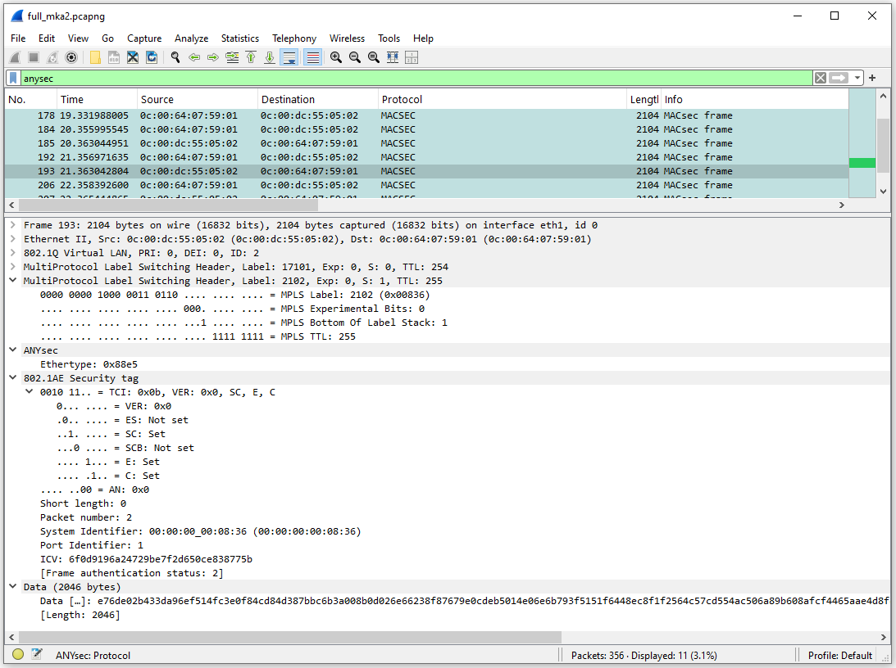

# ANYsec Packet Dissectors for Wireshark

ANYsec is a Nokia quantum-safe technology that provides low-latency, line-rate native encryption for any transport, on any service, at any time, and under any load conditions without impacting performance.

[Nokia's ANYsec](https://www.nokia.com/networks/technologies/fp5/) is based on [IEEE 802.1AE MACsec](https://1.ieee802.org/security/802-1ae/) (Media Access Control Security) and MKA (MACsec Key Agreement), but it extends their capabilities beyond Layer 2. In the control plane, the MKA protocol is modified from L2 Ethernet to UDP over IP, enabling its use in L3 networks. In the data plane it allows encryption for any transport technology. 
ANYsec can be tested using [ContainerLab (CLAB)](https://containerlab.dev/) and with available projects from [SRL-Labs](https://github.com/srl-labs), such as the [ANYsec/MACsec](https://github.com/srl-labs/sros-anysec-macsec-lab) lab.  

[Wireshark](https://www.wireshark.org/) is an essential tool for testing and validate ANYsec; however, since this technology is still a proprietary network encryption solution, public releases of Wireshark do not yet include ANYsec packet dissectors. 
This repository provides the ANYsec Packet Dissectors for Wireshark. 

## Installation
## Prerequisites/Requirements

The dissectors were tested on Wireshark version 4.4.5 with lua support for Linux and Windows 10 and 11 (not tested for MAC).

The 64-bit Windows version has lua support built-in. The official [installer](https://www.wireshark.org/download.html) for the x64 was used for development and tests.

On linux, there are different Wireshark builds for each different distribution, which means the dissectors might not work for all. In some Wireshark builds there is no lua support and some distributions maintain older Wireshark versions, that don't make the MACsec dissector available to be called through the lua API. We explain how to check for [lua support](#check-for-lua-support) and if the MACsec dissector is [callable through the lua API](#check-for-macsec-support).

If you own a Mac or a ARM windows and would like to test the dissector, please give us some feedback.

### [Check for Lua support](#check-for-lua-support)

In order to check if your Wireshark build has lua support, from the GUI select:
* "Tools" > "Lua Console"

 This option should open the lua console as shown in the picture below. If you don't see the option then lua is not supported.


Alternatively, if you're using linux you can run on your terminal:
```bash 
wireshark --version | grep Lua
``` 
 or if you're using Windows:
 ```powershell 
 "C:\Program Files\Wireshark\Wireshark.exe" --v | findstr Lua
 ``` 

The output should return "with Lua <lua version>" if there is lua support.


### [Check for macsec support](#check-for-macsec-support)

In order to check if your Wireshark build has support for dissecting MACsec through the lua API, open the lua console:
* "Tools" > "Lua Console"

```lua  
local macsec_dissector = Dissector.get("macsec")
if macsec_dissector then
    print("MACsec dissector is callable")
else
    print("MACsec dissector is not callable. This dissector is not usable")
end
 ```
The console will display if macsec is supported as shown in the picture below:


### Install the plugins

While starting the Wireshark will check on specific directories if there are any lua files to load. 
To install the ANYsec dissectors you just need to copy the dissector folder to the plugins directory and restart the wireshark. The dissector files under the "4.4_anysec_plugins" folder are:
* **anysec-heuristics.lua**
* **mka-ip-heuristics.lua**
* **helper.lua** - only used to validate macsec support
* **mka-ip.lua** - Not in use. This is for future use if a UDP port is reserved for MKA over UDP by IANA.

To find your Wireshark plugin folder, where you should place the dissectors, select:
* "Help" > "About Wireshark" > "Folders" 

You may search by lua and you'll get an output similar to the picture bellow. You may choose the "Global Lua Plugins" or the "Personal Lua Plugins" folders.


In summary, the general steps to be followed independently on your operating system should be:

1. Clone the repository or download the lua folder/files.

2. Copy the folder with the anysec-heuristics.lua and mka-ip-heuristics.lua files to the "Lua Plugins" folder and (re)start Wireshark.


The successful loading of the dissectors can be checked by selecting:
* "Help" > "About Wireshark" > "Plugins", and then search by "Lua"


### Linux

In Linux, you may use eihter the global or the personal plugins folder to install the dissectors. 
Both directories depende on the system, in these tests the global directory is ```/usr/lib64/wireshark/plugins/```
and the personal Lua plugins folder usually is ```$HOME/.local/lib/wireshark/plugins```. To install the dissectors under the personal folder:

1. Clone the repository: ```git clone https://github.com/xavixava/anysec-dissectors.git```

2. Create the "Personal Lua Plugins" directory, if it doesn't exist: ```mkdir -p $HOME/.local/lib/wireshark/plugins```

3. Copy the dissectors to the "Personal Lua Plugins": ```cp anysec-dissectors/anysec-heuristics.lua $HOME/.local/lib/wireshark/plugins/.; cp anysec-dissectors/mka-ip-heuristics.lua $HOME/.local/lib/wireshark/plugins/.```

It might be necessary to change your "Personal Lua Plugins" on these instructions according to the one on your Wireshark installation.

### Windows

In Windows, you may use eihter the global or the personal plugins folder to install the dissectors. 
The global folder ussually is ```"C:\Program Files\Wireshark\plugins"``` and the personal Lua plugins folder usually is ```$env:APPDATA\Wireshark\plugins```. To install the dissectors under the personal folder:

1. Create the "Personal Lua Plugins" directory, if it doesn't exist: ```New-Item -Type Directory -Force -Path $env:APPDATA\Wireshark\plugins```

2. Download the lua dissectors: ```cd $env:APPDATA\Wireshark\plugins; curl -o anysec.lua https://raw.githubusercontent.com/xavixava/anysec-dissectors/refs/heads/main/4.4_anysec_plugins/anysec-heuristics.lua; curl -o mka-ip.lua https://raw.githubusercontent.com/xavixava/anysec-dissectors/refs/heads/main/4.4_anysec_plugins/mka-ip-heuristics.lua``` 

It might be necessary to change your "Personal Lua Plugins" on these instructions according to the one on your Wireshark installation.

## Usage

Once you successful install the wireshark plugins you can start playing with it, but you need a ANYsec setup.

> [!TIP]  
> If you don't have a setup but want to test the dissectors anyway, you may simply used the example pcap file provided in this repo.

> [!IMPORTANT]  
> You may use [ContainerLab (CLAB)](https://containerlab.dev/) and [EdgeShark](https://containerlab.dev/manual/wireshark/#edgeshark-integration) to build and test ANYsec your setup.

> [!IMPORTANT]  
> You may also use available projects from [SRL-Labs](https://github.com/srl-labs), such as the [ANYsec/MACsec](https://github.com/srl-labs/sros-anysec-macsec-lab) lab. 


### Display Filters

You may apply display filters to your wireshark capture to make it easier to identify the packets and inspect the contents. 
The most relevante filters are shown in the table below:

| Filter            | Description   |
| ----------------- |-------------  | 
| mkaoudp           | display MKA UDP over IP packets only                                                     |
| mka               | display all MKA (UDP over IP and standard MKA over Ethernet)                             |
| mka && !mkaoudp   |display only standard MKA over Ethernet (excludes mkaoudp)                                | 
| anysec            | display anysec data plane packets only (mpls labels followed by the macsec header)       |
| macsec            | display anysec and standard macsec packets (Ethernet followed by the macsec header)      |
| macsec && !anysec | display only the standard macsec packets (excludes anysec)                               | 

### Tests

The following picture displays an ANYsec packet:
> [!Note]  
> There are 2 MPLS Labels (transport and Encryption SID (ES)) followed by the ANYsec header (EtherType (0x88e5) and the 802.1AE header). The payload is encrypted.



The following picture displays MACsec frame:
> [!Note] 
> The Ethernet header is followed by the MACsec/802.1AE header. The EtherType 0x88e5 is part of the Ethernet header.


The following picture displays MKA UDP over IP packet:


The following picture displays MKA Ethernet frame:


### Tests with command line 

If you're using a remote server, you've multiple options such as export display, use EdgeShark, create an SSH tunnel and pipe the capture to you laptop, or use the server bash directly.
In any case you need to install or update Tshark on the server. Follows an example for a Ubuntu server:

```bash
# Install
sudo apt install tshark
tshark --version
tshark -D
#Update
sudo add-apt-repository ppa:wireshark-dev/stable -y
sudo apt update
sudo apt install wireshark tshark -y
```

Now that you installed Thsark on the server, you can do remote captures from the remote server to your laptop.
The easiest way is to use EdgeShark, but if you don't have it, then you can use an SSH tunnel.  
From your Windows laptop cmd/command prompt create an ssh tunnel to execute Tshark an pipe the output to your local Wireshark. Follows an example of the commands you need to execute it. This will open your wireshark and display all the packets.
> [!Note] 
> Display filters aren't supported when capturing and saving/pipe the captured packets. As such, for a remote capture you don't need to install the plugins on the remote server only on your local computer wireshark.

```bash
### Example! Replace IP and windows path
ssh root@<IP> "ip netns exec <CONTAINER> tshark -l -i <IF1> [-i <IF2>] [-i <IFN>] -w -" | "<WIRESHARK PATH>" -k -i -
ssh root@10.82.182.179 "ip netns exec pe1 tshark -l -i eth1 -i eth2 -w -" | "c:\Program Files\Wireshark\Wireshark.exe" -k -i -
```

If you prefer to simply use the linux bash on the remote server, then you need to upload the dissector folder or files to the tshark global or personal directory. This may vary, but for these tests we've used "/usr/lib64/wireshark/plugins/" in a Ubuntu server.  

> [!Warning]  
> You must ensure you install or update your Wireshark/TShark version to one that supports mpls, macsec and lua. Below is as example of the error you get if we try to mannually load the dissector to a tshark version that has no lua support. 
```bash
[root@Airframe3 4.4_anysec_plugins]# tshark -X lua_script:anysec-heuristics.lua
tshark: This version of TShark was not built with support for Lua scripting.
[root@Airframe3 4.4_anysec_plugins]# 
```

Then you may perform a capture on any CLAB node by using the following command on the server OS:
```bash
#syntax
ip netns exec <CLAB-NODE> <TSHARK-COMMAND>
#example
ip netns exec pe1 tshark -l -i eth1 -i eth2 -Y anysec
``` 

Follows the output for your reference:
<details>
<summary>Output</summary>

```bash
root@airframe4:~# ip netns exec pe1 tshark -l -i eth1 -i eth2 -Y anysec
Running as user "root" and group "root". This could be dangerous.
MACsec dissector is callable
Capturing on 'eth1' and 'eth2'
  338 45.165884112 0c:00:4e:f8:ca:02 → 0c:00:ed:3e:30:02 MACSEC 146 MACsec frame
  339 45.201685773 0c:00:ed:3e:30:02 → 0c:00:4e:f8:ca:02 MACSEC 146 MACsec frame
^C2 packets captured
root@airframe4:~# 

### Verbose

root@airframe4:~# ip netns exec pe1 tshark -l -i eth3 -i eth1 -i eth2 -Y anysec -V
Running as user "root" and group "root". This could be dangerous.
MACsec dissector is callable
Capturing on 'eth3', 'eth1', and 'eth2'
Frame 41: 146 bytes on wire (1168 bits), 146 bytes captured (1168 bits) on interface eth2, id 2
    Section number: 1
    Interface id: 2 (eth2)
        Interface name: eth2
    Encapsulation type: Ethernet (1)
    Arrival Time: Mar 24, 2025 11:29:10.185464546 UTC
    UTC Arrival Time: Mar 24, 2025 11:29:10.185464546 UTC
    Epoch Arrival Time: 1742815750.185464546
    [Time shift for this packet: 0.000000000 seconds]
    [Time delta from previous captured frame: -0.183198096 seconds]
    [Time delta from previous displayed frame: 0.000000000 seconds]
    [Time since reference or first frame: 3.132801341 seconds]
    Frame Number: 41
    Frame Length: 146 bytes (1168 bits)
    Capture Length: 146 bytes (1168 bits)
    [Frame is marked: False]
    [Frame is ignored: False]
    [Protocols in frame: eth:ethertype:vlan:ethertype:mpls:anysec:anysec:macsec:data]
Ethernet II, Src: 0c:00:4e:f8:ca:02 (0c:00:4e:f8:ca:02), Dst: 0c:00:ed:3e:30:02 (0c:00:ed:3e:30:02)
    Destination: 0c:00:ed:3e:30:02 (0c:00:ed:3e:30:02)
        .... ..0. .... .... .... .... = LG bit: Globally unique address (factory default)
        .... ...0 .... .... .... .... = IG bit: Individual address (unicast)
    Source: 0c:00:4e:f8:ca:02 (0c:00:4e:f8:ca:02)
        .... ..0. .... .... .... .... = LG bit: Globally unique address (factory default)
        .... ...0 .... .... .... .... = IG bit: Individual address (unicast)
    Type: 802.1Q Virtual LAN (0x8100)
    [Stream index: 0]
802.1Q Virtual LAN, PRI: 0, DEI: 0, ID: 2
    000. .... .... .... = Priority: Best Effort (default) (0)
    ...0 .... .... .... = DEI: Ineligible
    .... 0000 0000 0010 = ID: 2
    Type: MPLS label switched packet (0x8847)
MultiProtocol Label Switching Header, Label: 18002, Exp: 0, S: 0, TTL: 255
    0000 0100 0110 0101 0010 .... .... .... = MPLS Label: 18002 (0x04652)
    .... .... .... .... .... 000. .... .... = MPLS Experimental Bits: 0
    .... .... .... .... .... ...0 .... .... = MPLS Bottom Of Label Stack: 0
    .... .... .... .... .... .... 1111 1111 = MPLS TTL: 255
MultiProtocol Label Switching Header, Label: 2001, Exp: 0, S: 1, TTL: 255
    0000 0000 0111 1101 0001 .... .... .... = MPLS Label: 2001 (0x007d1)
    .... .... .... .... .... 000. .... .... = MPLS Experimental Bits: 0
    .... .... .... .... .... ...1 .... .... = MPLS Bottom Of Label Stack: 1
    .... .... .... .... .... .... 1111 1111 = MPLS TTL: 255
ANYsec
    Ethertype: 0x88e5
802.1AE Security tag
    0010 11.. = TCI: 0x0b, VER: 0x0, SC, E, C
        0... .... = VER: 0x0
        .0.. .... = ES: Not set
        ..1. .... = SC: Set
        ...0 .... = SCB: Not set
        .... 1... = E: Set
        .... .1.. = C: Set
    .... ..00 = AN: 0x0
    Short length: 0
    Packet number: 406
    System Identifier: 00:00:00_00:07:d1 (00:00:00:00:07:d1)
    Port Identifier: 3
    ICV: ede98f215e948e3be658f9cae0022465
    [Frame authentication status: 2]
Data (88 bytes)

0000  ec 0d 39 0f 3b 2e e8 08 56 c3 f3 c6 20 c5 73 23   ..9.;...V... .s#
0010  f0 fe e1 9f 8b 10 e2 4c 01 61 77 e1 06 99 65 ae   .......L.aw...e.
0020  b8 c2 a1 db bc db 06 37 64 4d d5 27 bd ea 41 b9   .......7dM.'..A.
0030  0b 29 42 5a 2b 29 bb 7c 5a 77 e8 26 ff 2f 50 69   .)BZ+).|Zw.&./Pi
0040  be 84 df 95 8c 0d 54 ce f3 b9 86 96 2f 9e ac bc   ......T...../...
0050  0c e5 7d eb e0 8d 4f 04                           ..}...O.
    Data: ec0d390f3b2ee80856c3f3c620c57323f0fee19f8b10e24c016177e1069965aeb8c2a1dbbcdb0637644dd527bdea41b90b29425a2b29bb7c5a77e826ff2f5069be84df958c0d54cef3b986962f9eacbc0ce57debe08d4f04
    [Length: 88]

``` 
</details>

# Conclusion
These wiresharks dissectors are very useful and a powerful tool to filter and inspect anysec and mka packets.


